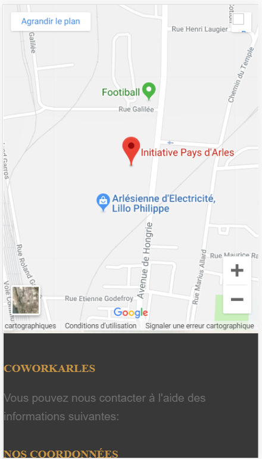
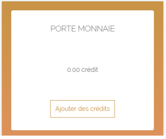

# Documentation - Coworking

Cette documentation a pour but de présenter le projet de CoWorking de l'entreprise Initiative Pays d'Arles,          
ses intervenants, les problèmes posés et aussi les solutions proposées.

Elle explique clairement chaque point du projet sans être trop technique pour que même un non initié à l'informatique puisse comprendre.


# I.  Présentation du projet

Initiative Pays d'Arles est une entreprise qui propose un dispositif d’accompagnement et de financement destiné aux porteurs 
de projet souhaitant créer une entreprise.        
Dans le cadre de la construction de son espace de Coworking, Initiative Pays d'Arles souhaite mettre en place
des outils de suivi, de gestion et de communication de ces activités.             
        
Le travail du groupe est d'analyser le besoin, proposer des solutions, les valider selon une
priorité à mettre en place, stabiliser le système de ces applications et les tableaux de bords.


# II. Les étudiants travaillant sur le projet

* `Baptiste Marmier`
* `Pierre Roman`
* `Maxime Dupont`
* `Sebastien Carreno`
* `Adrien Durouge`
* `Axel Pilato`

# III. Les langages utilisés

* HTML - CSS
* JavaScript
* PHP - MySQL


# IV.  Les fonctionnalités attendu

|   Fonctionnalités  |    Priorité    | Complexité |
|--------------------|----------------|------------|
| Accèder à la présentation  | 5 | 1 |
| Visualiser les partenaires | 5 | 1 |
| Visualiser en 3D les espaces | 1 | 2 |
| Achat nombre de crédits | 5 | 3 |
| Forfait 3 mois  | 5 | 3 |
| Contact | 4 | 1 |
| Forfait 6 mois | 5 | 3 |
| Forfait 12 mois | 5 | 3 |
| Agenda des événements public | 2 | 2 |
| Agenda réservation | 3 | 8 |
| Accès à l'annuaire des membres | 3 | 8 |
| Accès aux événements privé | 3 | 5 |
| Accès aux petites annonces | 3 | 3 |
| Ajouter des espaces | 5 | 8 |
| Ajouter des forfaits | 5 | 8 |
||| 


# V. L'API

Pour réaliser toutes les fonctionnalités attendues sur le site, nous avons pensé à réaliser une API en json.    
            
API est l'acronyme d'Application Programming Interface, que l'on traduit en français par interface de programmation d'application.           
L'API peut être résumée à une solution informatique qui permet à des applications de communiquer entre elles et de s'échanger mutuellement des services ou des données.      
Il s'agit en réalité d'un ensemble de fonctions qui facilitent l'accès aux services d'une application.             
                           
### **a) Les routes et les fonctions de l'API**

La table de routage est indispensable à la navigation sur le site et permet une meilleure sécurité.      
       
Chaque route permet d'accéder à une fonctionnalité différente.


| Routes         |  Paramètres                                                | Valeurs Retourné                            | Description      | Token requis   |
|----------------|------------------------------------------------------------|---------------------------------------------|------------------|----------------|
|/users/register/| nom, prenom, email, password, (image), adresse, ville, tel | {'id':id de l'utilisateur}                  | S'enregistrer    | Non |
|/users/login/   | email, password                                            | {'userId':userId, 'token':token}            | Se connecter     | Non |
|/users/info/ || {'email:email, 'nom':nom, 'prenom':prenom, 'adresse':adresse, 'ville':ville,'tel':tel, 'idCat':idCat, 'id':id} | Recuperer infos utilisateurs | Oui |
|/users/search | recherche, (limit), (offset), (order) | Pour chaque utilisateurs trouvé, renvoie ses infos execpté 'idCat'| Rechercher des utilisateurs | Oui |
|/users/info/update/nom | nom  | renvoie toute les informations    | Modifier le nom utilisateur                                               | Oui |
|/users/delete   | id   | {'succesful':'utilisateur supprimé'}     | Supprimer un utilisateur                                                  | Oui |
|/categorie/info/droits | idCat | | Recupere tous les droits d'une categorie                                                                   | Oui |    
|/categorie/create      | libelle, accreditation, tableau de droit | {'id':idCat}  | Ajouter une categorie                                     | Oui |
|/lieu/ajouter     | libelle, prix | {'id':idLieu}                                 | Ajouter un lieu                                           | Oui |
|/lieu/search      | recherche, (limit), (offset), (order)   | Pour chaque lieux trouvé, renvoie le libelle et le prix | Rechercher des lieux  | Oui |
|/reservation/reserver | dateDeb, dateFin, idLieu | {'id':idReserv}   | Creer une reservation                                                  | Oui |      
||||||

### **b) Extrait de code de l'API**   

Ceci est un extrait de la fonction "register" qui va permettre à un utilisateur de se créer un compte.

````
register: function (req, res) {
//valeurs
var nom = req.body.nom;
var prenom = req.body.prenom;
var email = req.body.email;
var password =req.body.password;
var categorie = 1;

    //gestion des erreurs de paramètre manquant
    if (nom == null) {
        return res.status(400).json({'error': 'nom manquant'});
    }
    if (prenom == null){
        return res.status(400).json({'error': 'prenom manquant'});
    }
    if (email == null){
        return res.status(400).json({'error': 'email manquant'});
    }
    if (password == null){
        return res.status(400).json({'error': 'mot de passe manquant'});
    }

    if(nom.length >= 50 || nom.length <= 1){
        return res.status(400).json({'error': 'le nom doit être compris entre 2 et 50 caractères'});
    }
    if(prenom.length >= 25 || prenom.length <= 2){
        return res.status(400).json({'error': 'le nom doit être compris entre 3 et 25 caractères'});
    }
    if (!EMAIL_REGEX.test(email)){
        return res.status(400).json({'error': 'email invalide'});
    }
    if (!PASSWORD_REGEX.test(password)){
        return res.status(400).json({'error': 'le mot de passe doit être compris entre 4 et 11 caractère et pocèder au moins 1 caractère numérique'});
    }

    //gestion d'utilisateur existant
    models.User.findOne({
        attributes: ['email'],
        where: { email: email}
    }).then(function(userFound){
        if (!userFound){
            bcryptjs.genSalt(10, function(err, salt) {
                bcryptjs.hash(password, salt, function(err, hash) {
                    var newUser = models.User.create({
                        nom: nom,
                        prenom : prenom,
                        email: email,
                        password: hash,
                        idCat: categorie
                    }).then(function (newUser) {
                        return res.status(201).json({'id': newUser.id});
                    }).catch(function (err) {
                        return res.status(500).json({'error': 'impossible d\'add l\'utilisateur'});
                    });
                });
            })
        }
        else
            return res.status(409).json({'error': 'l\'utilisateur existe déjà'});

    }).catch(function (err) {
            return res.status(500).json({'error': 'impossible de check si l\'user existe ' + err});
        });
}
````

### **c) Les codes de type de droit**

Chaque type d'utilisateurs sera associés à plusieurs types de droit limitant ou non leurs accès.

|     Code    |    Libélle   |
|-------------|--------------|    
| 000 - 999   |  Modification |
|     001     |  Modifier la réservation des utilisateur avec une accreditation inferieur |
|     002     |  Modifier la réservation detous les autres utilisateurs  |      
|     010     |  Modifier ses propres évenements |
|     011     |  Modifier les évenements des utilisateurs qui ont une accreditation inferieur | 
|     012     |  Modifier les évenements de tous les autres utilisateurs | 
|     022     |  Modifier tous les lieux |
|     030     |  Modifier son propre profil utilisateur |
|     031     |  Modifier le profil des utilisateurs qui ont un niveau d'accreditation inférieur au siens |
|     032     |  Modifier tous les profils des utilisateurs |
|     040     |  Modifier ses propres achats |
|     041     |  Modifier les achats des utilisateur qui ont un niveau d'accreditation inférieur au siens |
|     042     |  Modifier les achats de tous les utilisateurs |
|     052     |  Modifier tous les forfaits |
|     062     |  Modifier toutes les categories |
|             |              |
| 1000 - 1999 |  Création    |   
|    1000     |  Création de sa réservation |
|    1001     |  Création des réservations des utilisateurs avec un niveau d'accreditation inferieur |
|    1002     |  Création des réservations de tous les utilisateurs |
|    1012     |  Création d'evenement |
|    1022     |  Créaton de lieu |
|    1040     |  Acheter des credits pour soi |
|    1041     |  Acheter des crédits pour ceux dont l'accreditation est inferieur à la siennes |
|    1042     |  Acheter des crédits pour nimporte quel utilisateur |
|    1052     |  Création de forfaits |
|    1062     |  Création de catégorie |
|             |              |     
| 2000 - 2999 | Suppression  | 
|    2000     | Suppression de ses propres réservations |
|    2001     | Suppression des réservations des utilisateurs ayant une accréditation inferieur à la sienne |
|    2002     | Suppression des réservations de tous utilisateurs |
|    2010     | Suppression de ses propres évènements |
|    2011     | Suppression des évènements des utilisateurs dont l'accréditation est inferieur à la siennes |
|    2012     | Suppression des évènements de tous les utilisateurs |
|    2022     | Suppression des lieux |
|    2030     | Supprimer son profil utilisateur |
|    2031     | Supprimer le profil des utilisateurs dont l'accreditation est inferieur à la sienne |
|    2032     | Supprimer le profil de nimporte quel utilisateur |
|    2040     | Suppression de ses propres achats |
|    2041     | Suppression des achats des utilisateur dont l'accreditation est inferieur à la siennes |
|    2042     | Suppression des achats de nimporte quel utilisateur |
|    2052     | Suppression de forfaits |
|    2061     | Suppression de categorie dont l'accreditation est inferieur à son accréditation |
|    2062     | Suppression de categorie |
|             |              |    

### **d) Les codes d'erreur**


# VI. Base de Données 


La base de données est un point central dans la création et la gestion du site car elle va permettre de stocker toutes les informations nécessaires au bon fonctionnement du site et elle permet aussi l'expansion pour des modifications futures.

Cette base de données contient 12 tables.

| Nom de la table | Fonctionnalités | Exemple contenu d'une table |
|-----------------|-----------------|-----------------|
| User | Informations relative à un utilisateur | (nom, prenom, ville, mdp, image, etc.) |
| Categorie | Permet de savoir le type de chaque utilisateur       | (coworker, administrateur) |
| Droit | Associe chaque catégorie d'utilisateurs à des types de droit pré-enregistrer | (admin : [2062; 1022; 1062; etc.]) |
| TypeDroit | Contient tous les types de droit | (déjà vu plus haut) |
| Achat | Permet de gerer l'achat de forfait pour les utilisateurs | |
| Forfait | Informations relative à un forfait | (nombre de crédits, prix, nom, etc.)                     |
| Reservation | Informations nécessaire pour réserver | (date de début, date de fin, l'utilisateur, etc.) |
| Lieu | Informations relative à un lieu | (prix, description)                        |
| LieuEvent | Associe un lieu à un évenement | (date, heure, lieu et evenement)       |
| Evenement | Informations nécessaire pour un évenement | (adresse, description)      |
| Participation | Associe un utilisateur à un évenement pour montrer sa participation | 
| Partenaire | Informations relative à un partenaire | (nom, URL site, logo, etc.)    |
||||


# VII. Page d'accueil 

Ceci sont des exemples de pages web possible pour le site web de coworking.    
       
Les pages ont était réalisé grâce au Framework "Angular" développé par Google, qui permet de réaliser des pages web dynamiques et mieux optimisés.         
Le site web est réalisé en "Responsive", c'est-à-dire que le site s'adapte à la taille de l'écran ainsi qu'aux mobiles, tablettes et télévisions 
avec le même confort visuel.

### **a) Version ordinateur**

Page d'accueil du site de CoWorking résumant le principe, l'histoire de la ville, le lieu ainsi qu'un footer regroupant toutes les informations, 
réseaux pour contacter l'entreprise.

      


### **b) Version mobile**

Même chose que précedemment mais en version mobile avec les images adaptée et optimisé pour tous les types d'écrans, petit ou grand.   




### **c) Page de connection/création**

Page de connection pour les adhérents possèdant déjà un compte.      
Il leur suffit de s'authentifier via l'adresse email et le mot de passe qu'ils ont défini lors de la création de leur compte.


Page de création du compte adhérent nécessitant uniquement les informations obligatoires.     
Le mot de passe n'a pour l'instant aucune condition particulière mais ceci peut être modifié très simplement.      


### **d) Espace personnel des adhérents**

Userboard ou espace personnel de chaque utilisateur depuis celui-ci chaque utilisateur peut : 

* Gérer ses crédits  (voir les fonds de son porte-monnaie et ajouter des fonds) 

* Accéder à l'agenda (voir les salles réserver ou en réserver, consulter les événements)

* Accéder à un annuaire des membres         
                  
           
       
Même chose que précédemment mais en version mobile.    





### **e) Extrait de code**

**app.module.ts**       

````
//import des modules
import { BrowserModule } from '@angular/platform-browser';
import { NgModule } from '@angular/core';
import { AppRoutingModule } from './app-routing.module';
import { AppComponent } from './app.component';
import { LoginComponent } from './login/login.component';
import { UserSpaceComponent } from './user-space/user-space.component';
import {RouterModule, Routes} from '@angular/router'

@NgModule({
  declarations: [
    AppComponent,
    LoginComponent,
    UserSpaceComponent
  ],
  imports: [
    BrowserModule,
    AppRoutingModule,
    RouterModule.forRoot([
      {path: 'login', component:LoginComponent}
    ])
  ],
  providers: [],
  bootstrap: [AppComponent]
})
export class AppModule { }
````      

**index.html**
````
<!doctype html>
<html lang="fr">
<head>
  <meta charset="utf-8">
  <title>CoWorkArles</title>
  <base href="/">

  <meta name="viewport" content="width=device-width, initial-scale=1">
  <link rel="icon" href="assets/arles.png" />


</head>
<body>
  <app-root></app-root>
</body>
</html>
````

### **f) Liste des modules**     


# VIII. Calendrier 

Réaliser un calendrier était très important dans ce projet car c'est autour de lui que va se mettre en place toute l'organisation de l'espace Coworking.

Le calendrier a diverses fonctionnalités qui changent selon les types d'utilisateurs.


### **a) Accueil**     

Page d'accueil du calendrier permettant de réserver ainsi que visualiser les réservations. 


### **b) Réservation**

Les adhérents peuvent consulter le calendrier pour voir les réservations.


Un menu déroulant permet de changer la visualisation des réservations en fonction des salles possibles.

         

Ils peuvent aussi réserver des salles ou des bureaux en cliquant sur une case vide et en complétant un formulaire de réservations.     
Les réservations se font par demi d'heure.


       

### **c) Evenements**           

Chaque adhérent peut cliquer sur une date d'événement pour avoir accès à de multiples informations telles que : la date et l'heure, le titre, la description ainsi que le lieu.             

           

Il y'a deux types de réservation d'événements, celle à l'espace co-working et celle ailleurs.         
Pour celle à l'espace, il suffit de remplir un petit formulaire en sélectionnant les types d'espaces réservés.                      

               

Pour les réservations en dehors de l'espace, il faut compléter le même formulaire puis un second pour renseigner l'adresse.          


